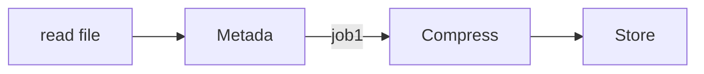
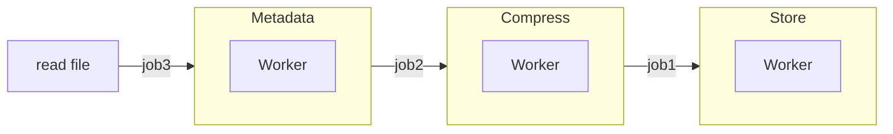
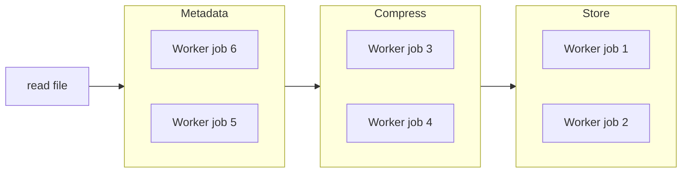

# Batch processor
[](https://github.com/mfloriach/file_processor/actions/workflows/test.yml)


Batch processor example to test concurrency patterns in golang.

Modules
- Metadata: get year, name, start, authors,....
- Compress: compress and move to S3 bucket
- Store: save into Mongo DB

## Visual tools

| Tool |  Description  |
|:-----|:--------:|
| [mongo](http://localhost:8082/)                   |Database management |
| [minio](http://127.0.0.1:9001)                    |S3 alternative manager  |
| [stats](http://localhost:18066/debug/statsview)   |Golang related statuses|
| [cadvisor](http://localhost:8080/docker)          |Hardware related statuses|

## How to use

### Start
```bash
$ docker compose up -d # start services
$ make run             # run in parallel mode
$ make run-sequencial  # run sequential
$ make run-concurrent  # run concurrent
$ make run-parallel    # run parallel
```

### Benchmark
```bash
$ make bench 
$ make benchErrs 
$ make benchConc 
```

## Architecture

### Sequencial


### Concurrent


### Parallel


